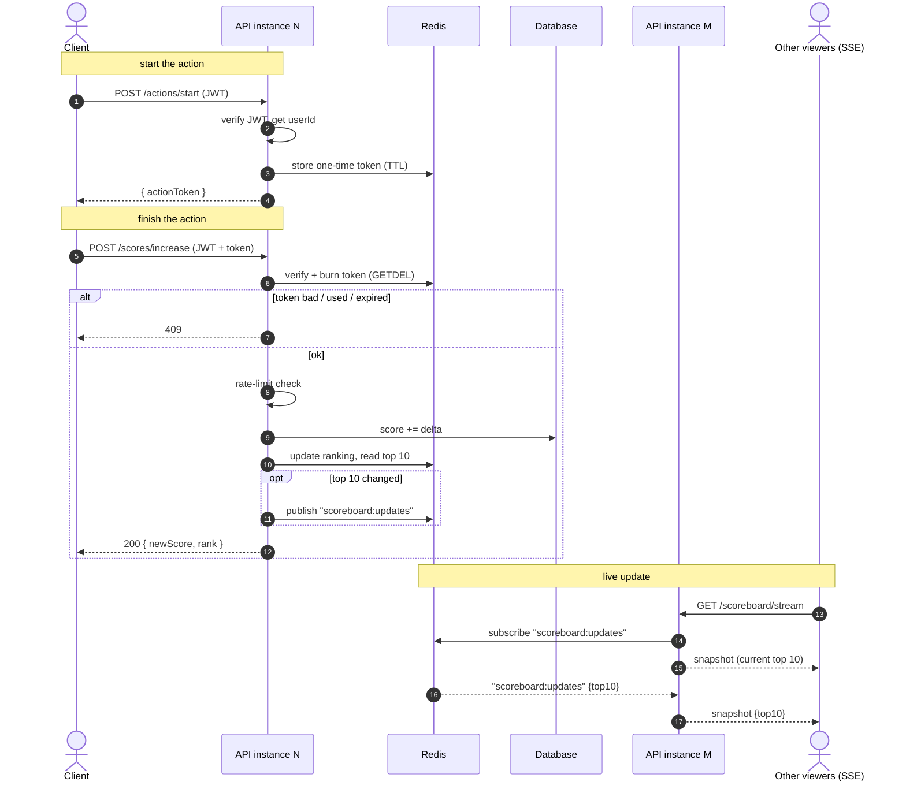

# Scoreboard Module

Backend spec for the site's scoreboard — a panel showing the **top 10 users by score** that
**updates live**. This is the brief for the implementing team.

---

## 1. Overview

What the module does:

- Takes "I finished an action" calls and bumps the user's score.
- Serves the current top 10.
- Pushes the new top 10 to everyone watching, no refresh needed.

Ground rules:

- **DB is the source of truth** for scores; a Redis sorted set holds the ranking for cheap reads.
- **Clients never send the score or the user id.** The server decides the points from the action
type and reads the user from the auth token.

---

## 2. API Endpoints


| Method | Path                        | Purpose                               | Auth        |
| ------ | --------------------------- | ------------------------------------- | ----------- |
| `POST` | `/api/v1/actions/start`     | Begin an action, get a one-time token | JWT         |
| `POST` | `/api/v1/scores/increase`   | Report completion, bump the score     | JWT + token |
| `GET`  | `/api/v1/scoreboard`        | Current top 10 (plain JSON)           | —           |
| `GET`  | `/api/v1/scoreboard/stream` | Live top 10 over SSE                  | —           |


**2.1 `POST /actions/start`** — called when the action starts; returns a short-lived, single-use
token tied to the user (see §5 for why).

```json
{ "actionToken": "a1b2c3...", "expiresInSec": 300 }
```

**2.2 `POST /scores/increase`** — called when the action finishes; body carries only the token.

```json
// request
{ "actionToken": "a1b2c3..." }
// response
{ "userId": "u_123", "newScore": 1840, "rank": 7 }
```

Errors:

- `401` — bad/missing JWT
- `409` — token missing / expired / already used
- `429` — rate-limited
- `500` — DB write failed (nothing changes, nothing is broadcast)

**2.3 `GET /scoreboard`** — top-10 snapshot, for initial page load.

**2.4 `GET /scoreboard/stream`** — SSE stream. Sends the current top 10 on connect, a fresh top
10 whenever the ranking changes, and a heartbeat every ~15s.

```
event: snapshot
data: {"top10":[ ... ]}

: ping
```

---

## 3. Decision — Live update transport

**Question:** push updates via WebSockets, SSE, or polling?

- **WebSockets** — two-way; more to build/operate, for nothing we need here.
- **Polling** — not really live, wastes requests.
- **SSE** — fits the one-way shape (server → client): plain HTTP, browser auto-reconnects.

**→ Decision: SSE.** Revisit WebSockets only if the client ever needs to talk back on this channel.

Three things to get right in production (the first two depend on the deployment assumed in §6):

- **Run over HTTP/2** *(assumes browser clients)* — HTTP/1.1 caps a browser at ~6 connections per
domain, and each SSE stream holds one open. HTTP/2 multiplexing removes the limit.
- **Heartbeat** *(assumes a proxy/LB in front)* — proxies silently drop idle connections after
30–60s. A `: ping` every ~15s keeps it warm and surfaces dead connections to clean up.
- **Resend the full top 10, never replay deltas** — SSE won't backfill what was missed offline,
so on every (re)connect we send the current snapshot. Latest state is all that matters. (Holds
regardless of deployment.)

---

## 4. Decision — Cross-instance broadcast

The write path tells the stream about a change: after `/scores/increase` writes the score, it
**publishes** the new top 10 to a channel; every instance is subscribed and pushes it down the
SSE connections it holds.

**Question:** do we need Redis for this?

- **One instance** — no; write path and connections share a process, an in-memory emitter works.
- **Multiple instances** — yes; a stream is pinned to the instance that accepted it, but the
score change can land on a different one. Something must carry the update across.

Common mistakes:

- Not an SSE quirk — **WebSockets need the same bridge.**
- **Sticky sessions don't fix it** — the update and the connection still start on different instances.

**→ Decision: Redis Pub/Sub as the bridge** (assumes multiple instances — see §6). Single instance:
in-memory emitter is fine.

---

## 5. Decision — Preventing unauthorized increases

**Question:** how do we stop people cheating their score up? Two distinct problems:

- **Raising someone else's score** — solved by auth: verify the JWT, take the user id *from the
token*, never from the client. Tampered request fails the signature check.
- **A real user faking their own score** — the hard one: a logged-in user calls
`/scores/increase` in a loop without doing the action. Nothing is forged, so auth can't help.

You can't fully stop the second case when the action is purely client-side — the client can be
scripted. So we layer defenses to make it expensive and visible:

- **Server owns the score** — client can't pass a value to inflate.
- **One-time action token** — `/actions/start` issues a random token (Redis, with TTL);
`/scores/increase` verifies and burns it atomically (`GETDEL` / small Lua script). Blocks replay
and bare calls. TTL must cover the action's duration → a per-action-type config, not a constant;
only the server mints tokens.
- **Rate limiting** per user — caps scoring speed.
- **Anomaly detection** (offline) — flags impossible patterns (too fast, too regular) for review.

**→ Decision: JWT for identity + those four layers for self-cheating.**

> Caveat for reviewers: the token proves the user *started* an action, not that they *finished*
> it. If an action can be validated server-side, do that instead — strictly better (see §9).

---

## 6. Execution Flow




---

## 7. Assumptions

The brief gives requirements, not the existing architecture — the decisions above rest on these.
If one turns out wrong, revisit the decision it supports.

**Deployment**:

- Clients are **browsers** → HTTP/2 and `EventSource` constraints apply.
- A **proxy / load balancer** sits in front → idle connections get cut → heartbeat needed.
- **More than one app instance** → live updates need Redis Pub/Sub, not in-process events.
- **Redis is available** for tokens, ranking, and pub/sub.

**Domain:**

- An **auth service** already issues JWTs at login; we only verify them.
- The **action is a black box** and may be purely client-side → hence the layered anti-cheat.
- **Points are decided server-side** per action type.
- Board is **top 10 only**; a user's own rank when outside it comes back in the increase response.
- **A second or two of lag** on the board is acceptable.

---

## 8. Improvements

- **Publish only when the top 10 actually changes** — most bumps don't touch it; diff first to cut broadcast noise.
- **Idempotency key on the write** — protects against double-counting on client retries.

